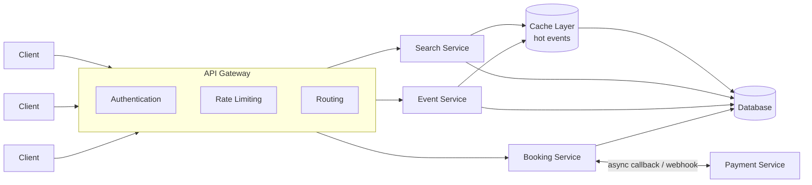
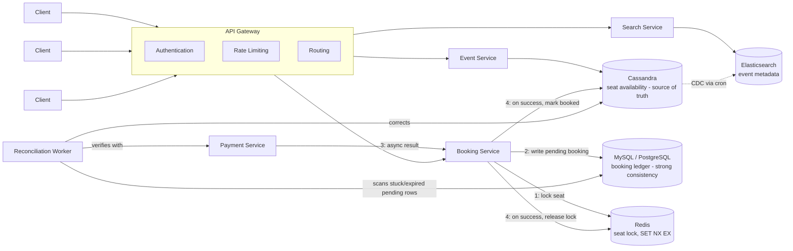

# BookMyShow — System Design

A movie/event ticket booking platform, designed end-to-end covering requirements gathering, core entities, API design, high-level architecture, and low-level data/booking flow.

---

## 1. Requirements

### Functional Requirements
- User should be able to search for an event based on title, location, or date
- User should be able to view event details (seats, description, metadata)
- User should be able to book an event

### Non-Functional Requirements
- **Scale:** ~100 million daily active users
- **CAP tradeoff:**
  - Highly **available** for searching / viewing events
  - Highly **consistent** for booking a particular ticket (no double-booking)

---

## 2. Back-of-the-Envelope Estimation

Assumptions: 100M DAU, ~10% browse an event per day, ~2% of those actually attempt a booking, peak traffic ≈ 3x average (evening/weekend surge).

| Metric | Rough calculation | Value |
|---|---|---|
| Search/browse requests/day | 100M × 10% × ~5 searches | ~50M/day → ~580 QPS avg, ~1.7K QPS peak |
| Booking attempts/day | 100M × 2% | 2M/day → ~23 QPS avg, ~70 QPS peak |
| Redis lock keys (peak, 10 min TTL) | 70 QPS × 600s | ~42K concurrent locked seats — trivial for Redis |
| Event metadata storage | 500K active events × ~2KB | ~1 GB (easily cached) |
| Seat availability rows | 500K events × ~200 seats avg | ~100M rows in Cassandra |

**Takeaway:** Booking QPS is low relative to search QPS — the system is read-heavy overall, but booking correctness (not booking throughput) is the hard problem. This justifies optimizing search for availability/scale and booking for consistency, exactly as the CAP split suggests. It also tells us Redis load from seat-locks is small — the real risk is **hot partitions** on a handful of high-demand events (e.g., a blockbuster's opening show), not aggregate volume.

---

## 3. Core Entities

- **User**
- **Event** (movie / show)
- **Venue** (theatre / hall)
- **Ticket / Booking**
- **Payment** (owned by a separate Payment Service)

---

## 4. API Design

| Method | Endpoint | Description |
|---|---|---|
| `GET` | `/v1/search?q={searchKeyword}&location={location}&date={date}` | Returns `List<EventId>` (paginated) |
| `GET` | `/v1/event/{eventId}` | Returns event details, location & available seats |
| `POST` | `/v1/booking/reserve` | Atomically reserves selected seats |
| `POST` | `/v1/booking/confirm` | Confirms booking with payment, idempotent |

`userId` is passed via an auth header (not in the body) so the booking can be securely mapped to the authenticated user.

```http
POST /v1/booking/reserve
Idempotency-Key: <client-generated-uuid>
{
  "eventId": "...",
  "seats": ["L5", "L6"]
}

Response: { "bookingId": "...", "expiresAt": "<TTL timestamp>" }
```

```http
POST /v1/booking/confirm
Idempotency-Key: <client-generated-uuid>
{
  "bookingId": "...",
  "paymentToken": "..."     // returned by Payment Service, not raw card details
}
```

The `Idempotency-Key` matters because network retries are common on `reserve`/`confirm` — without it, a retried request could double-charge or double-reserve.

---

## 5. High-Level Design (HLD)



Changes from the first pass:
- **Payment is now a separate service**, not a field in the confirm payload — it has its own async confirmation path (webhook/callback), which is how real payment gateways behave.
- **A cache layer sits in front of the DB** for Search/Event reads to absorb hot-event read spikes (e.g., a blockbuster's release day) without hammering Cassandra directly.

---

## 6. Low-Level Design (LLD)



### Why multiple data stores?

| Store | Purpose | Reasoning |
|---|---|---|
| **Cassandra** | Seat availability (source of truth for reads) | Write-heavy, highly available — good fit for high-frequency availability updates and read scale |
| **Elasticsearch** | Event search & metadata | Cassandra isn't optimized for flexible querying, so metadata is replicated into ES via CDC |
| **MySQL / PostgreSQL** | Booking ledger (source of truth for a booking's state) | Strong consistency / transactional guarantees so a seat can't be double-confirmed |
| **Redis** | Short-lived seat lock | Atomic `SET key value NX EX 600` lock to hold a seat during the booking window |

---

## 7. Booking Flow — Fixing the Race Condition

**Original issue:** "check if key exists in Redis, then set it" is a check-then-act race — two concurrent requests can both pass the check before either writes, and both would believe they hold the seat.

**Fix:** Use a single atomic Redis command instead of a check + a separate write:

```
SET seat:{eventId}:{seatId} {userId} NX EX 600
```

- `NX` → only set the key if it does **not** already exist (atomic test-and-set)
- `EX 600` → auto-expire after 10 minutes if never confirmed
- If the command returns success → caller holds the lock
- If it returns failure → seat is already locked by someone else, reject immediately

### End-to-end flow

1. User attempts to lock seat **L5** for an event.
2. Booking Service issues `SET seat:{eventId}:L5 {userId} NX EX 600` against Redis.
   - **Fails (key exists)** → another user is holding it → reject / show unavailable.
   - **Succeeds** → seat is now locked to this user for 10 minutes.
3. Booking Service writes a **`PENDING` booking row** to SQL, keyed by the client's `Idempotency-Key` (so a retried `reserve` call is a no-op, not a duplicate).
4. Client calls `/confirm` with a payment token. Booking Service hands off to the **Payment Service** and waits for its async result (webhook/callback), rather than trusting a client-supplied "payment succeeded" flag.
5. **On payment success (within TTL):**
   - SQL booking row updated to `CONFIRMED` (single transactional write — ledger source of truth).
   - Cassandra seat status updated to `BOOKED`.
   - Redis lock released early (no need to wait out the TTL).
6. **On payment failure, or TTL expiry with no confirmation:**
   - Redis key auto-expires — seat becomes lockable again.
   - SQL row updated to `EXPIRED`/`FAILED` by the reconciliation worker.

### Handling the crash-in-the-middle case

If the Booking Service crashes *after* the Payment Service confirms success but *before* Cassandra/SQL are updated, the system must not silently lose the booking or silently lose the seat. A **reconciliation worker** periodically:
- Scans SQL for `PENDING` rows whose TTL has expired.
- Cross-checks each with the Payment Service (source of truth for "was this actually paid?").
- If paid but not marked `CONFIRMED` → completes the booking and re-marks the seat `BOOKED` in Cassandra.
- If not paid → marks `EXPIRED` and confirms the seat is released.

This makes the multi-store write (Redis + SQL + Cassandra) **eventually consistent with a self-healing path**, instead of assuming all three writes always succeed together.

---

## 8. Consistency vs. Availability Summary

- **Consistency-first path:** Booking confirmation → SQL ledger + reconciliation worker (no silent double-booking, no silently lost bookings)
- **Availability-first path:** Search & browsing → Elasticsearch + Cassandra + cache layer, tolerant of slightly stale data
- **Hot-key protection:** Cache layer + Cassandra partitioning for high-demand events, so one blockbuster's traffic doesn't degrade the whole platform

This split satisfies the original non-functional requirement — highly available for search/viewing, highly consistent for booking — while also addressing the failure-mode and scale questions an interviewer would probe on a follow-up.