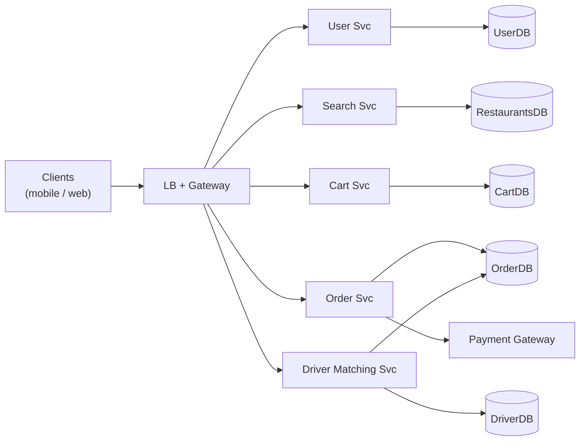
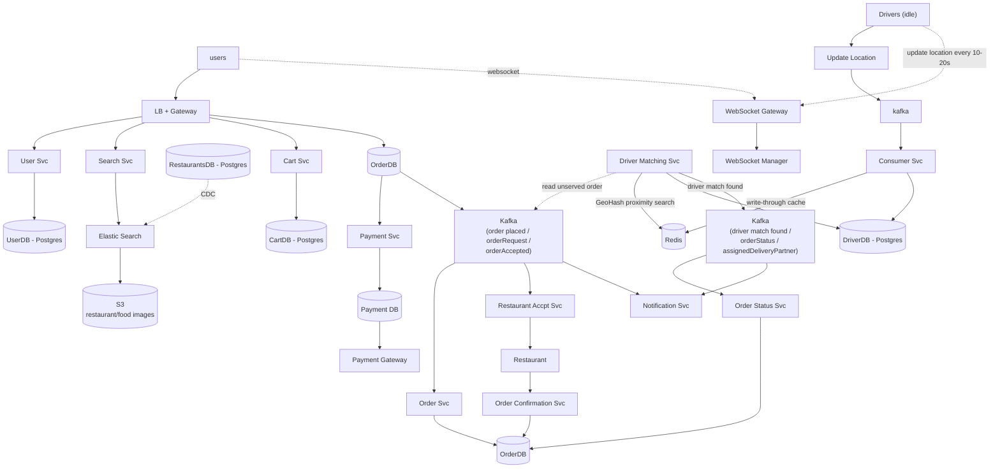

# Food Ordering App — System Design

A system design practice exercise covering functional/non-functional requirements, core entities, API design, high-level design (HLD), and low-level design (LLD) for a food delivery application (Swiggy/DoorDash/Uber Eats style).

---

## 1. Functional Requirements

- User should be able to register into our application
- List down all the nearby restaurants based on user location
- User should be able to search restaurants based on title and menu
- Show all the menu items in the restaurant's display
- User should be able to select item(s) into the cart and make payment to confirm an order from the nearest restaurant
- Once the restaurant accepts, find a nearby delivery partner based on driver location, optimizing for delivery time
- Once the delivery partner picks up the order, give near real-time location of the delivery partner to the user
- User should get notifications at all stages and be able to view past orders in their profile

## 2. Non-Functional Requirements

- **Scale:** 50M users, 1M restaurants
- **CAP tradeoffs:**
  - High **availability** for search/discovery (browsing restaurants should never be blocked)
  - High **consistency** for payments and order placement (money and order state must not be lost or duplicated)

## 3. Core Entities

- User
- Restaurant
- Food Menu
- Delivery Agent / Partner
- Payment

## 4. API Design

```
POST  /v1/users/register                              {userMetaData}          (+ login/logout/update)
GET   /v1/restaurants/nearby?lat={lat}&long={long}&rad={radius}  -> List<RestaurantId> (paginated)
GET   /v1/restaurants/search?title={title}&menuItem={item}       -> List<RestaurantId> (paginated)
GET   /v1/restaurants/{id}                             -> Restaurant metadata + reviews
GET   /v1/restaurants/{id}/menu                         -> List of menu items
POST  /api/cart/items                                   {itemId, qty}          (+ update/delete) -> CartId
POST  /api/orders                                        {orderId}              (+ update/delete) -> OrderId
GET   /api/delivery/{orderId}/tracking
```

## 5. High-Level Design



Client requests hit an **LB + Gateway**, which routes to independent services — User, Search, Cart, Order, and Driver Matching — each backed by its own datastore. Order creation triggers a Payment Gateway call; Driver Matching links a delivery partner to the order once payment/restaurant acceptance completes.

## 6. Low-Level Design



Key details:

- **User Svc** → UserDB (Postgres): `userId, email, password, address, ...metadata`
- **Search Svc** → Elasticsearch (food/restaurant search by location) + S3 (restaurant/food images), CDC-synced from RestaurantsDB (Postgres)
- **Cart Svc** → CartDB (Postgres): `cartId, hotelId, List<Item>(itemId+qty), ...metadata`
- **Order flow:** OrderDB → Payment Svc → Payment DB → Payment Gateway → Order Svc, coordinated via **Kafka** (topics: `order placed`, `orderRequest`, `orderAccepted`, `delivery partner assigned`)
- **Restaurant Accpt Svc** consumes Kafka to notify the restaurant; restaurant accept/reject flows back through Kafka
- **Driver Matching Svc** reads unserved orders from Kafka, uses **GeoHash proximity search** against Redis (populated via a Consumer Svc doing write-through caching from driver location updates over Kafka) to find the nearest idle driver. Redis entries use TTL to expire offline drivers.
- **DriverDB** (Postgres): `driverId, name, mobileNo, GeoLocation(lat+long)`
- **Order Status Svc** updates delivery partner assignment once accepted, publishes to a second Kafka topic (`orderStatus`, `assignedDeliveryPartner`) consumed by Notification Svc
- **Order Confirmation Svc** confirms the driver once the delivery partner accepts the order
- **WebSocket Gateway + WebSocket Manager**: drivers push location updates every 10–20s; once an order is assigned, updates increase to every 5–10s and are relayed to the user in near real-time over WebSocket

---

## Status / Open Questions

Things still being worked through (see discussion log or open issues):

- Payment ↔ order consistency: no explicit callback/webhook or idempotency strategy yet for the gap between payment gateway confirmation and OrderDB write
- No timeout/retry-to-next-restaurant flow if a restaurant doesn't respond to `orderRequest`
- `GET /v1/users/{id}/orders` (past orders) missing from API list despite being a stated FR
- Notification Svc fan-out (push/SMS/email) and dedup/delivery guarantees not yet specified
- Gateway-level idempotency and rate limiting not yet addressed